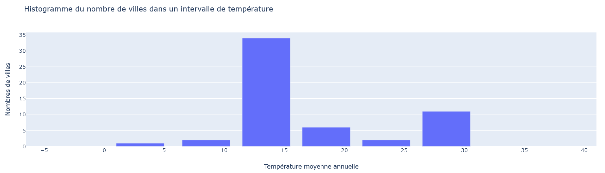
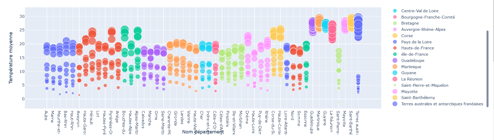
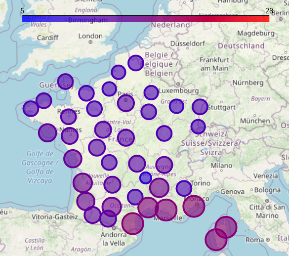
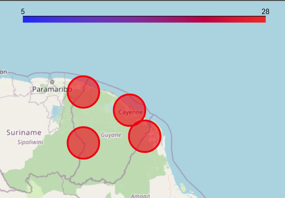
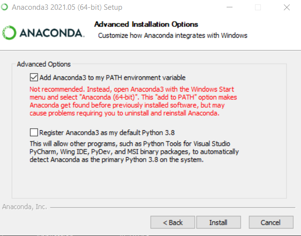
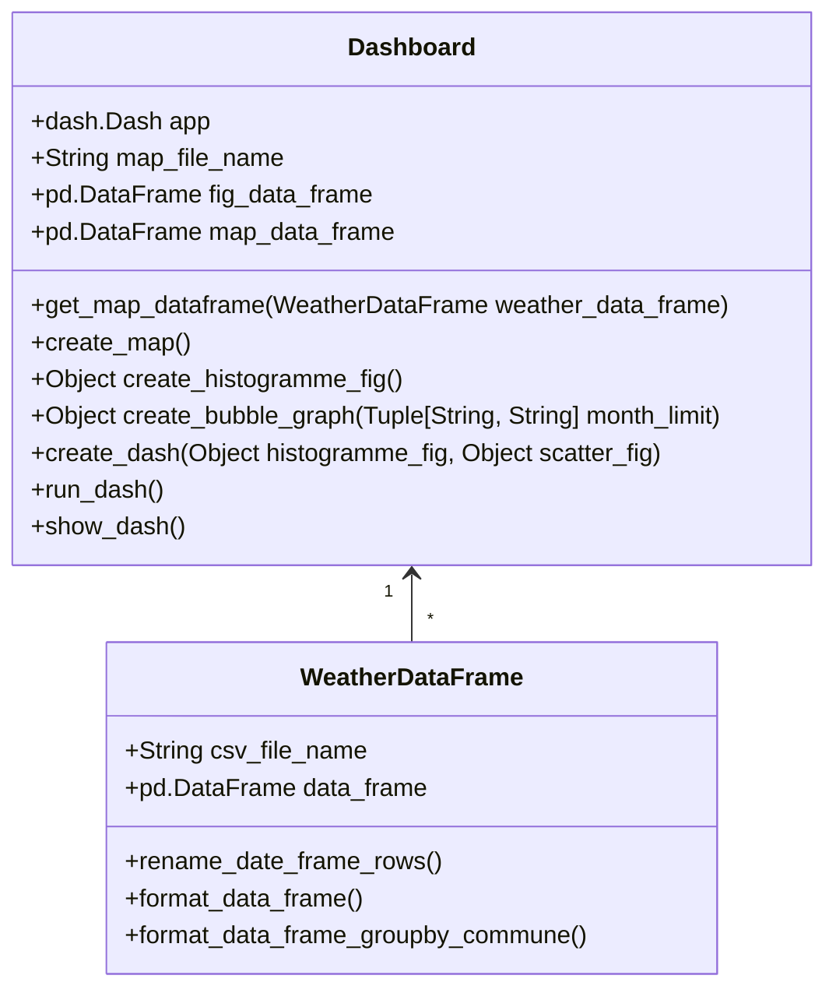

# Weather : Open Data Project

    Par DA SILVA REMI et GAO CHANG

Pour cloner notre repository faite `git clone https://git.esiee.fr/dasilvar/dasilvaremi_gaochang_opendataproject.git`

# Description
L'objectif du mini projet est de traiter un sujet d'intérêt public. Nous utiliserons des données publiques d'Open Data.

Nous avons décidé de choisir comme sujet la météo, qui est donc un sujet un commun à chacun.

Nous allons afficher les températures moyenne annuel d'une année en France. Nous affichons également il y a aussi une carte qui permet de visualiser les températures moyenne annuel en France.

## Traitement des données
Nous les avons pris sur le site OpenDataSoft qui est un site où on peut retrouver la majorité des données ouvertes. 
Etant donné que nous somme limités en nombre de données et sur leur traitement par OpenDataSoft lors des appels par API. 
Nous avons décidé de passer par un fichier CSV qui ne sera donc pas automatiquement mis à jour par notre application.
- [Lien de la page d'OpenDataSoft](https://public.opendatasoft.com/explore/dataset/donnees-synop-essentielles-omm/table/?flg=fr&sort=date)
- [Lien de téléchargement du fichier CSV complet](https://public.opendatasoft.com/explore/dataset/donnees-synop-essentielles-omm/download/?format=csv&timezone=Europe/Berlin&lang=fr&use_labels_for_header=true&csv_separator=%3B)
- [Lien de téléchargement du fichier CSV de 2021](https://public.opendatasoft.com/explore/dataset/donnees-synop-essentielles-omm/download/?format=csv&refine.date=2021&timezone=Europe/Berlin&lang=fr&use_labels_for_header=true&csv_separator=%3B)

Les données seront découpées selon les intervalles suivante :
- 8  &nbsp; &nbsp; à &nbsp;&nbsp; -1
- 0  &nbsp; &nbsp; à &nbsp; &nbsp; 5
- 6  &nbsp; &nbsp; à &nbsp;&nbsp;10
- 11 &nbsp; à &nbsp; 15
- 20 &nbsp; à &nbsp; 25
- 26 &nbsp; à &nbsp; 30
- 31 &nbsp; à &nbsp; 35
- 36 &nbsp; à &nbsp; 40
- 41 &nbsp; à &nbsp; 60

# Rapport d'analyse

## Analyse de l'histogramme
L'histogramme que vous trouvez çi-dessous a été générée selon les données de 2021.
Nous pouvons tout d'abord remarqué que la température moyenne oscille entre 3 et 35 C°. Nous apercevons une température moyenne globale de 13.5 °C en France, nous pouvons en conclure que les températures ont été assez froide en 2021.

## Analyse de l'évolution de température en 2021
Le graph que vous voyez çi dessous est l'évolution des températures pour une région sur l'année 2021. 
Nous remarquons que les températures sont assez égale en 2021 pour un même mois, cependant nous pouvons remarquer de très fortes températures dans les DOM-TOM.
Nous pouvons donc déjà établir une première hypothèse que les DOM-TOM ont des températures bien plus élevées que le reste de la France. Nous vérifierons cette hypothèse dans la prochaine partie.

## Analyse de la carte
La carte çi-dessous est la carte météo selon les données de 2021.
Nous pouvons remarquer comme sur l'histogramme que les températures sont assez froides étant donné qu'elles oscillent 9 et 17.2 °C.
Nous remarquons également que le SUD EST de la France à des températures plus élevée que le reste de la France.
Nous pouvons donc en conclure que les températures de la France sont assez froide en 2021 et que le sud est la partie la plus chaude de la France.  

La carte çi-dessous est la carte météo en Guyane selon les données de 2021.
Contrairement à la carte précédente les températures sont bien plus élevés étant donné qu'elles oscillent entre 25 et 29 °C.
Nous pouvons donc en conclure que les DOM-TOM du SUD ont des températures bien plus chaudes que celle de la France et ont donc moins de température froide en dessous de d20 °C.

# User Guide
## Prérequis
Notre application est une application web en python. Dans notre cas, nous gérons les librairies avec le gestionnaire de librairies Anaconda 3. Vous pouvez tout à fait exécuter notre application sans Anaconda.

### Le code source
Afin d'exécuter notre application, vous aurez besoin d'avoir notre code source disponible sur ce [repository.](https://git.esiee.fr/dasilvar/dasilvaremi_gaochang_opendataproject.git)
Vous avez deux moyens de télécharger notre code source, soit vous télécharger le fichier ZIP disponible sur notre repository en cliquant sur l'icône download à côté de l'option clone.
Soit, vous clonez notre repository via Git, afin de faire cela vous pouvez suivre les instructions çi-dessous.

#### Installer git
Afin d'installer git aller sur le [site officiel de git](https://git-scm.com/downloads), puis choisissez votre OS et suivez les étapes d'installation.

#### Configuration de git
Il est possible que pour cloner notre repository, vous devez vous connecter. 
Si cela vous arrive connecter vous, avec votre compte gitlab en configurant git avec les commandes çi-dessous :
- `git config --global user.name userName`
- `git config --global user.email user@example.com`

##### Cloner notre repository
Pour cloner notre repository lancer git bash et allez sur un répertoire où vous souhaitez sauvegarder notre code source puis faite : 
`git clone https://git.esiee.fr/dasilvar/dasilvaremi_gaochang_opendataproject.git`

### Les outils
Afin d'exécuter notre application, il vous sera donc nécessaire d'avoir python. Vous pouvez télécharger Python sur le site officiel de [Python](https://www.python.org/downloads/).
Vous avez deux moyens à votre disposition afin de télécharger les librairies nécessaire à notre projet, soit via Anaconda, soit via PIP

#### ANACONDA
Afin de faciliter l'installation, nous utilisons dans notre cas le gestionnaire Anaconda.
- [Anaconda Invidual Edition](https://www.anaconda.com/products/individual) : C'est un package disposant des éléments suivant :
  - Le gestionnaire Anaconda permettant d'installer les libraires souhaité avec une interface graphique ou en ligne de commande
  - Python 3.8 permettant d'éxécuter notre application 
Il vous sera nécessaire lors de l'installation d'anaconda de cocher l'option pour set la variable PATH de windows.
  - 

#### PIP
C'est le module par default d'installation des librairies sur python.
Si vous ne l'avez pas nous vous invitons à suivre la procédure indiquée sur la [documentation de PIP](https://pip.pypa.io/en/stable/installation/).

## Configuration du projet
Afin d'assurer le bon fonctionnement du projet, vous devez d'abord configurer le projet en suivant soit l'étape 1 ou 2.

**Avertissemment : Merci de suivre les prérequis précédant afin de télécharger les outils nécessaire à l'installation**
**Remarque : Si vous suivez l'étape 1 vous aurez besoin d'anaconda**

1) Configuration avec Anaconda
Merci de suivre les étapes çi-dessous pour vous assurer d'avoir votre anaconda de configurer.
- [Création d'environnement anaconda](#40)
- [Les librairies](#41)

2) Configuration par fichier requirement.txt avec pip
Veuillez exécuter cette commande `pip install -r requirements.txt`.

Après avoir suivi une des deux étapes vous pouvez passer à l'étape [Executer notre application](#Executer notre application).

<h2 id="40">Creation d'environnement anaconda</h2>
Vous devrez créer un nouvel environnement Anaconda que vous appellerez avec le nom de votre choix, dans notre cas nous l'avons appelé "complete"
Afin de créer un environnement anaconda en ligne de commande merci d'exécuter cette ligne `conda create --name complete`. Vous pouvez remplacer le complete par le nom de votre choix pour l'environnement.

###<h3 id="41"> Les librairies</h3>
Il est nécessaire de télécharger avec Anaconda toutes ces librairies :
- [BRANCA](https://anaconda.org/conda-forge/branca) `conda install -c conda-forge branca`
- [DASH](https://anaconda.org/conda-forge/dash) `conda install -c conda-forge dash`
- [DASH-CORE-COMPONENTS](https://anaconda.org/conda-forge/dash-core-components) `conda install -c conda-forge dash-core-components`
- [DASH-HTML-COMPONENTS](https://anaconda.org/conda-forge/dash-html-components) `conda install -c conda-forge dash-html-components`
- [FOLIUM](https://anaconda.org/conda-forge/folium) `conda install -c conda-forge folium`
- [PANDAS](https://anaconda.org/anaconda/pandas) `conda install -c anaconda pandas`
- [PLOTLY-EXPRESS](https://anaconda.org/plotly/plotly_express) `conda install -c plotly plotly_express`

## Executer notre application
En respectant les prérequis précédemment cités, exécuter les commandes suivantes sur le CMD anaconda (Anaconda Prompt) afin de lancer notre programme :
- `conda activate complete`
- `cd CheminVersLeRépertoireDuProjet\OpenDataProject`
- `python main.py`
Une fois le programme exécuté vous verrez apparaitre une URL sur le CMD anaconda copiez là et collez là sur votre navigateur. Dans notre cas l'url est la suivante :
[MeteoProject-Localhost](http://127.0.0.1:8050/) : `http://127.0.0.1:8050/`

# Developer Guide

Ci-dessous ce trouve le diagramme de classe.
Toutes les classes çi dessous sont appelé par notre fichier main.
Nous allons vous expliquer le role des différentes classes :
- WeatherDataFrame : Elle gère la création, le formatage de la dataframe avec les données météos.
- Dashboard : Elle gère la création des différent éléments graphiques tel que la map, l'histogramme et le dashboard.

Nous pensons que la classe Dashboard peut être étendu en deux sous classe s'appelant Fig et Map gérant l'histogramme et la map.

