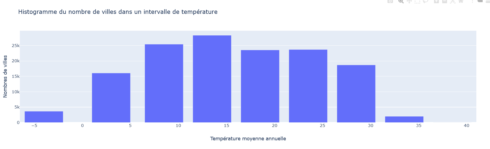
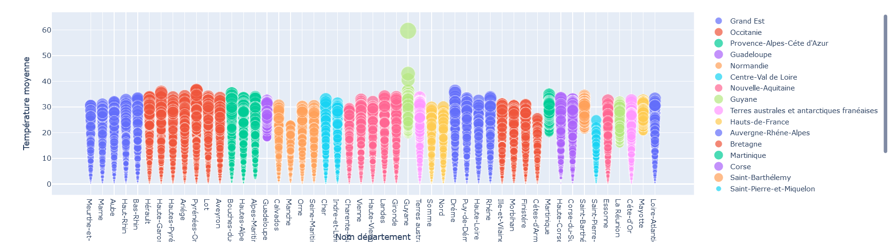
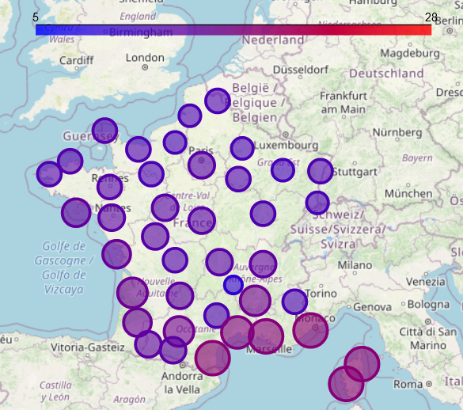
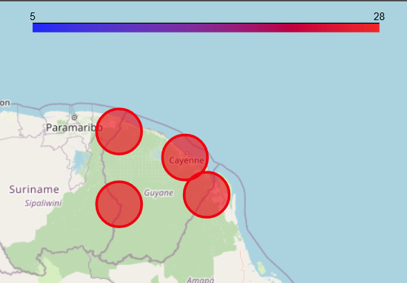
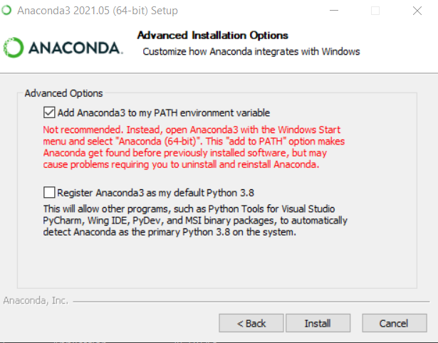
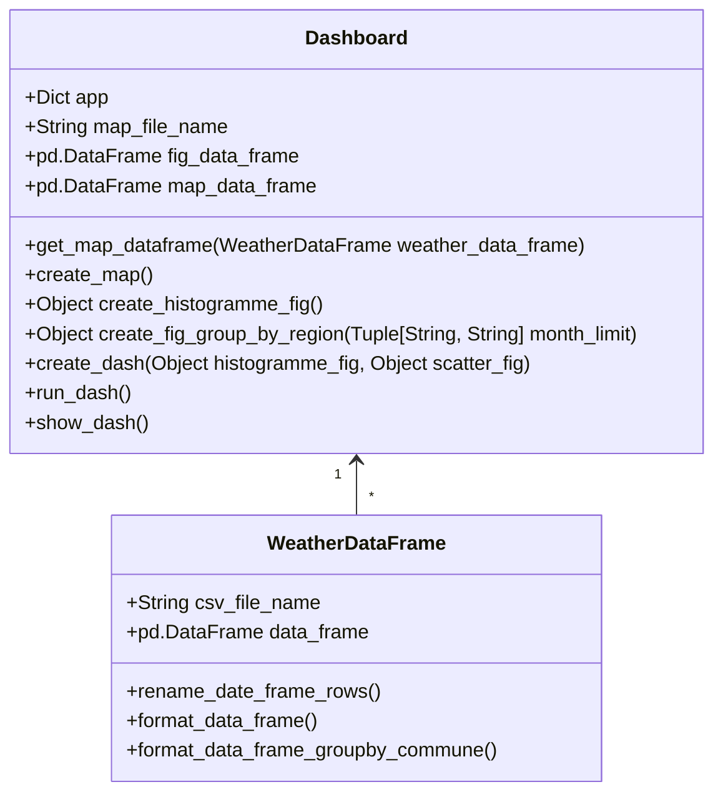

# Weather : Open Data Project

    Par DA SILVA REMI et GAO CHANG

# Description
L'objectif du mini projet est de traiter un sujet d'intérêt public. Nous utiliserons des données publiques d'Open Data.

Nous avons décidé de choisir comme sujet la météo, qui est donc un sujet un commun à chacun.

Nous allons afficher les températures moyenne annuel d'une année en France. Nous affichons également il y a aussi une carte qui permet de visualiser les températures moyenne annuel en France.

## Traitement des données
Nous les avons pris sur le site OpenDataSoft qui est un site où on peut retrouver la majorité des données ouvertes. 
Etant donné que nous somme limités en nombre de données et sur leur traitement par OpenDataSoft lors des appels par API. 
Nous avons décidé de passer par un fichier CSV qui ne sera donc pas automatiquement mis à jour par notre application.
- [Lien de la page d'OpenDataSoft](https://public.opendatasoft.com/explore/dataset/donnees-synop-essentielles-omm/table/?flg=fr&sort=date)
- [Lien de téléchargement du fichier CSV complet](https://public.opendatasoft.com/explore/dataset/donnees-synop-essentielles-omm/download/?format=csv&timezone=Europe/Berlin&lang=fr&use_labels_for_header=true&csv_separator=%3B)
- [Lien de téléchargement du fichier CSV de 2021](https://public.opendatasoft.com/explore/dataset/donnees-synop-essentielles-omm/download/?format=csv&refine.date=2021&timezone=Europe/Berlin&lang=fr&use_labels_for_header=true&csv_separator=%3B)

Les données seront découpées selon les intervalles suivante :
- 8  &nbsp; &nbsp; à &nbsp;&nbsp; -1
- 0  &nbsp; &nbsp; à &nbsp; &nbsp; 5
- 6  &nbsp; &nbsp; à &nbsp;&nbsp;10
- 11 &nbsp; à &nbsp; 15
- 20 &nbsp; à &nbsp; 25
- 26 &nbsp; à &nbsp; 30
- 31 &nbsp; à &nbsp; 35
- 36 &nbsp; à &nbsp; 40
- 41 &nbsp; à &nbsp; 60

# Rapport d'analyse

## Analyse de l'histogramme
L'histogramme que vous trouvez çi-dessous à été générée selon les données de 2021.
Nous pouvons tout d'abord remarqué que la température moyenne oscille entre -5 et 35 C°. Nous apercevons une température moyenne globale de 13.5 °C en France, nous pouvons en conclure que les températures ont été assez froide en 2021.

## Analyse de l'évolution de température en 2021
Le graph que vous voyez çi dessous est l'évolution des températures pour une région sur l'année 2021. 
Nous remarquons que les températures sont assez égale en 2021 pour un même mois, cependant nous pouvons remarquez des très fortes températures dans les DOM-TOM.
Nous pouvons donc déjà établir une première hyptohèse que les DOM-TOM ont des températures bien plus élevé que le reste de la France. Nous vérifierons cette hypothèse dans la prochaine partie.

## Analyse de la carte
La carte çi-dessous est la carte météo selon les données de 2021.
Nous pouvons remarquer comme sur l'histogramme que les températures sont assez froides étant donné qu'elles oscillent 9 et 17.2 °C.
Nous remarquons également que le SUD EST de la France à des températures plus élevée que le reste de la France.
Nous pouvons donc en conclure que les températures de la France sont assez froide en 2021 et que le sud est la partie la plus chaude de la France.  

La carte çi-dessous est la carte météo en Guyane selon les données de 2021.
Contrairement à la carte précedente les températures sont bien plus élevés étant donné qu'elles oscillent entre 25 et 31 °C.
Nous pouvons donc en conclure que les DOM-TOM du SUD ont des températures bien plus chaudes que celle de la France et ont donc moins de température froide en dessous de 20°C.

# User Guide
## Prérequis
Notre application est une application web en python. Nous gérons les librairies avec le gestionnaires de librairies Anaconda 3.

### Les outils
Afin d'exécuter notre application, il vous sera donc nécessaire d'avoir python, dans notre cas pour faciliter l'installation des librairies et de python nous utiliserons le gestionnaire Anaconda.
- [Anaconda Invidual Edition](https://www.anaconda.com/products/individual) : C'est un package disposant des éléments suivant :
  - Le gestionnaire Anaconda permettant d'installer les libraires souhaité avec une interface graphique ou en ligne de commande
  - Python 3.8 permettant d'éxécuter notre application 
Il vous sera nécessaire lors de l'installation d'anaconda de cocher l'option pour set la variable PATH de windows.
  - 

Vous devrez créer un nouvel environnement Anaconda que vous appellerez avec le nom de votre choix, dans notre cas nous l'avons appelé "complete"

### Les librairies
Il vous sera nécessaire de télécharger avec Anaconda toutes ces librairies :
- [BRANCA](https://anaconda.org/conda-forge/branca) `conda install -c conda-forge branca`
- [REQUESTS](https://anaconda.org/anaconda/requests) `conda install -c anaconda requests`
- [JSON](https://anaconda.org/jmcmurray/json) `conda install -c jmcmurray json`
- [DASH](https://anaconda.org/conda-forge/dash) `conda install -c conda-forge dash`
- [DASH-CORE-COMPONENTS](https://anaconda.org/conda-forge/dash-core-components) `conda install -c conda-forge dash-core-components`
- [DASH-HTML-COMPONENTS](https://anaconda.org/conda-forge/dash-html-components) `conda install -c conda-forge dash-html-components`
- [FOLIUM](https://anaconda.org/conda-forge/folium) `conda install -c conda-forge folium`
- [PANDAS](https://anaconda.org/anaconda/pandas) `conda install -c anaconda pandas`
- [PLOTLY-EXPRESS](https://anaconda.org/plotly/plotly_express) `conda install -c plotly plotly_express`

## Installation
En respectant les prérequis précédemment cités, exécuter les commandes suivantes sur le CMD anaconda (Anaconda Prompt) afin de lancer notre programme :
- `cd CheminVersLeRépertoireDuProjet\OpenDataProject`
- `python main.py`
Une fois le programme exécuté vous verrez apparaitre une URL sur le CMD anaconda copiez là et collez là sur votre navigateur. Dans notre cas l'url est la suivante :
[MeteoProject-Localhost](http://127.0.0.1:8050/) : `http://127.0.0.1:8050/`

# Developer Guide

Ci-dessous ce trouve le diagramme de classe.
Toutes les classes çi dessous sont appelé par notre fichier main.
Nous allons vous expliquer le role des différentes classes : 
- Api : Elle permet d'ouvrir, lire et fermer un flux vers une API. On l'utilise donc afin de permettre de récupérer les valeurs de notre API d'OpenData.
- WeatherDataFrame : Elle gère la création, le formatage de la dataframe avec les données météos.
- Dahsbord : Elle gère la création des différent éléments graphiques tel que la map, l'histogramme et le dashboard.

Nous pensons que la classe Dashboard peut être étendu en deux sous classe s'appelant Fig et Map gérant l'histogramme et la map.
